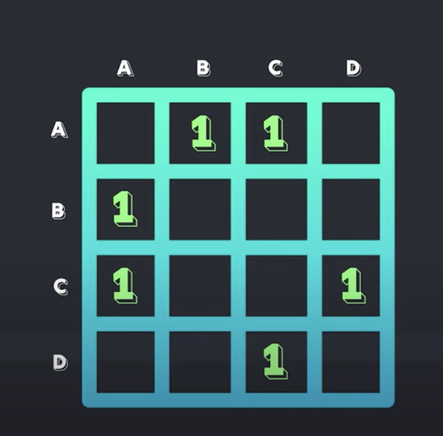
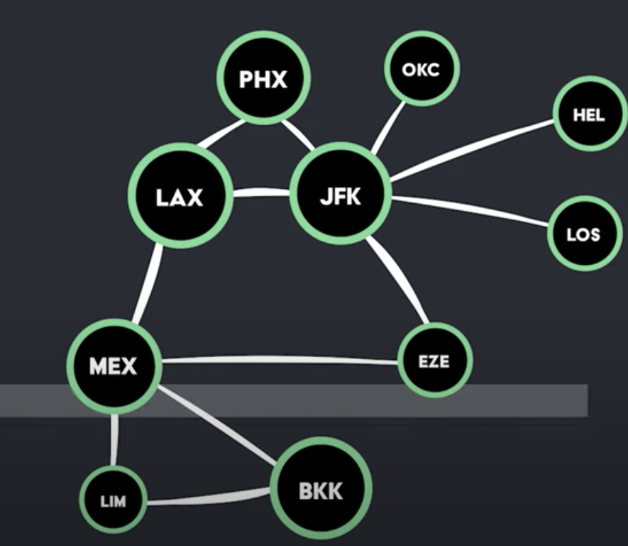
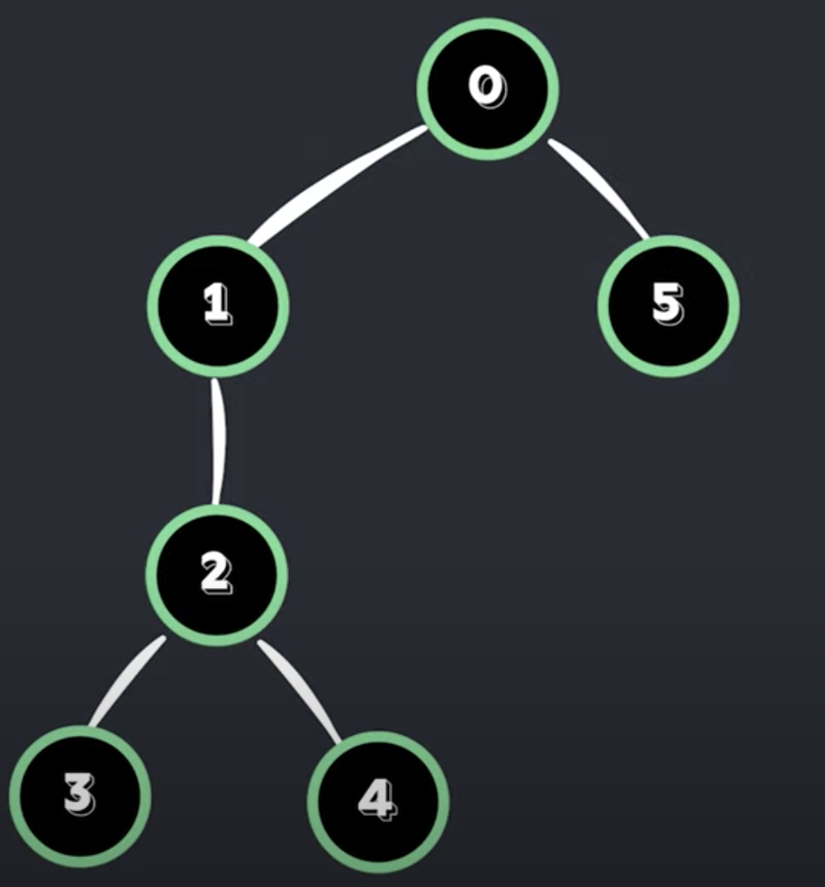
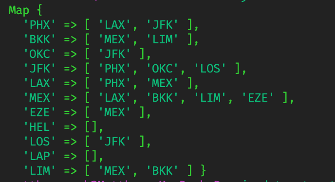

# Graph Traversal Algorithms
A graph is a non linear data structure that contains nodes and edges. A node or vertex is just a unique value while a edge represents a connection or relationship between two of these nodes.

* *Directed Graph* - relationship goes one way.
* *Undirected Graph* - relationship goes two ways.
* *Weighted Graph* - node has some additional data about the relationship...like the distance between two airports. Node might also point to itself, which is known as a *cycle*.

### Adjacency Matrix
Takes quadratic space complexity and quadratic time to insert a node into a graph.
An alternative approach is an adjacency list where you start with a collection of nodes then each item has its own array of its neighbors. This makes it faster to iterate over a node's edges and is more efficient with memory.

## Breadth First Search
For this example, what we will do is add all the children to a queue from the starting node, and once they've been visited, move on to the grandchildren, and so on... following this pattern until all nodes have been visited.

## Depth First Search
For this example, we can start with any random node then go to its first child, then second child, and so on...until there are no more children. Then, backtrack to the last node and continue this process.

This algorithm is implemented with a recursive function to achieve this behavior. It will continue to call itself until the condition is met.

## Adjacency List

Output of our adjacency list from `graph-traversal.js`

